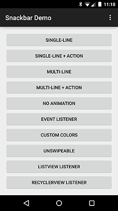
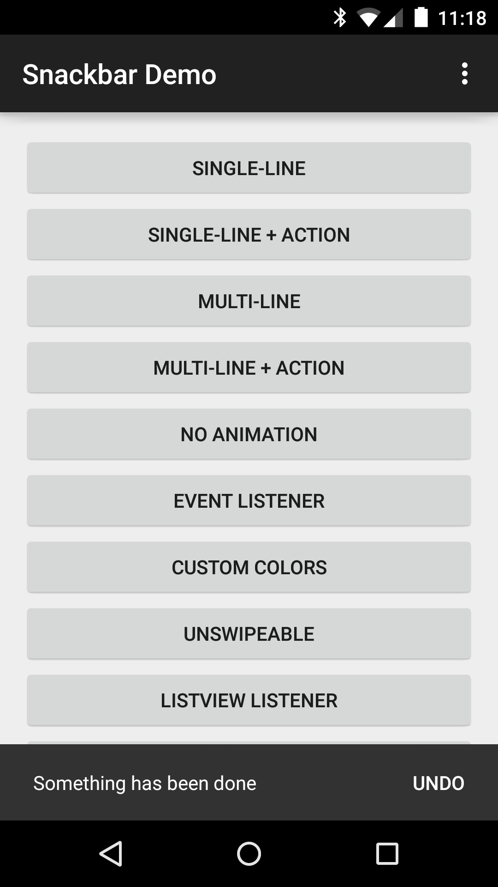
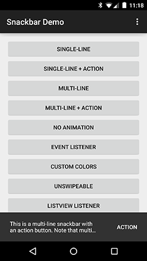
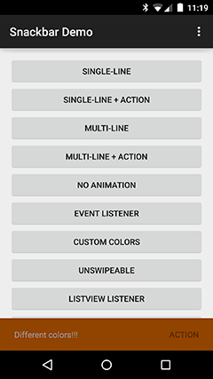
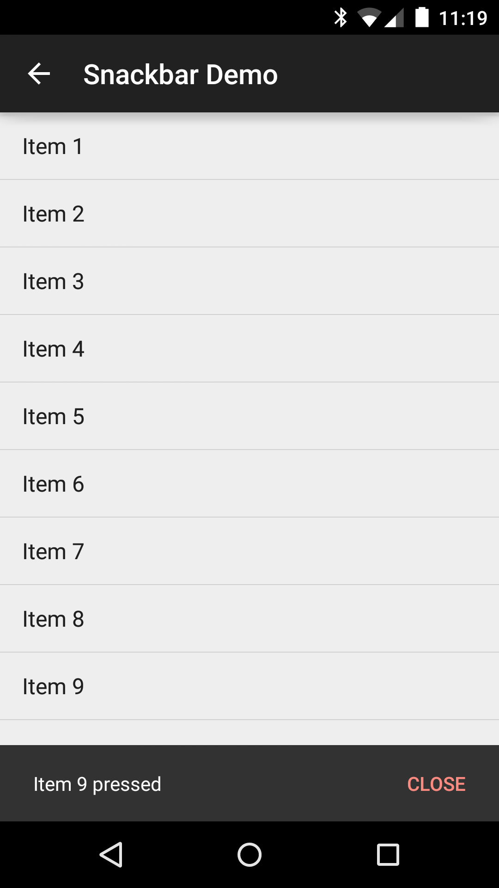

# DEPRECATED
This lib is deprecated in favor of Google's [Design Support Library](http://developer.android.com/tools/support-library/features.html#design) which includes a [Snackbar](http://developer.android.com/reference/android/support/design/widget/Snackbar.html) and is no longer being developed.

Thanks for all your support!

# Snackbar
[](https://travis-ci.org/nispok/snackbar) [](https://oss.sonatype.org/content/repositories/releases/com/nispok/snackbar/) [](https://android-arsenal.com/details/1/1160) [](http://androidweekly.net/issues/issue-129)

Library that implements <a href="http://www.google.com/design/spec/components/snackbars-and-toasts.html">Snackbars</a> from Google's <a href="http://www.google.com/design/spec/material-design/introduction.html">Material Design documentation</a>.
Works on API levels >= 8

<a href="https://play.google.com/store/apps/details?id=com.nispok.samples.snackbar">
  
</a>







## Installation
You can import the library from source as a module or grab via Gradle:
 
 ```groovy
 compile 'com.nispok:snackbar:2.11.+'
 ```
## Usage

Using the `Snackbar` class is easy, this is how you would display it on an `Activity`:

```java
Snackbar.with(getApplicationContext()) // context
    .text("Single-line snackbar") // text to display
    .show(this); // activity where it is displayed
```
However, I recommend you use the `SnackbarManager` to handle the Snackbars queue:

```java
// Dismisses the Snackbar being shown, if any, and displays the new one
SnackbarManager.show(
    Snackbar.with(myActivity)
    .text("Single-line snackbar"));
```
If you are using `getApplicationContext()` as the `Context` to create the `Snackbar` then you must
specify the target `Activity` when calling the `SnackbarManager`:

```java
// Dismisses the Snackbar being shown, if any, and displays the new one
SnackbarManager.show(
    Snackbar.with(getApplicationContext())
    .text("Single-line snackbar"), myActivity);
```
You can place the `Snackbar` at the bottom of a particular hierarchy of views. The sample app makes
use of this; check out [SnackbarImmersiveModeSampleActivity](./sample/src/main/java/com/nispok/samples/snackbar/SnackbarImmersiveModeSampleActivity.java):
```java
SnackbarManager.show(Snackbar snackbar, ViewGroup parent) { }
SnackbarManager.show(Snackbar snackbar, ViewGroup parent, boolean usePhoneLayout) { }
```
If you want an action button to be displayed, just assign a label and an `ActionClickListener`:

```java
SnackbarManager.show(
    Snackbar.with(getApplicationContext()) // context
        .text("Item deleted") // text to display
        .actionLabel("Undo") // action button label
        .actionListener(new ActionClickListener() {
            @Override
            public void onActionClicked(Snackbar snackbar) {
                Log.d(TAG, "Undoing something");
            }
        }) // action button's ActionClickListener
     , this); // activity where it is displayed
```
If you need to know when the `Snackbar` is shown or dismissed, assign a `EventListener` to it.
This is useful if you need to move other objects while the `Snackbar` is displayed. For instance,
you can move a Floating Action Button up while the `Snackbar` is on screen. Note that if you only
need to override a subset of the interface methods you can extend from `EventListenerAdapter`:

```java
SnackbarManager.show(
    Snackbar.with(getApplicationContext()) // context
        .text("This will do something when dismissed") // text to display
        .eventListener(new EventListener() {
            @Override
            public void onShow(Snackbar snackbar) {
                myFloatingActionButton.moveUp(snackbar.getHeight());
            }
            @Override
            public void onShowByReplace(Snackbar snackbar) {
                Log.i(TAG, String.format("Snackbar will show by replace. Width: %d Height: %d Offset: %d",
                                        snackbar.getWidth(), snackbar.getHeight(),
                                        snackbar.getOffset()));
            }
            @Override
            public void onShown(Snackbar snackbar) {
                Log.i(TAG, String.format("Snackbar shown. Width: %d Height: %d Offset: %d",
                        snackbar.getWidth(), snackbar.getHeight(),
                        snackbar.getOffset()));
            }
            @Override
            public void onDismiss(Snackbar snackbar) {
                myFloatingActionButton.moveDown(snackbar.getHeight());
            }
            @Override
            public void onDismissByReplace(Snackbar snackbar) {
                Log.i(TAG, String.format(
                                "Snackbar will dismiss by replace. Width: %d Height: %d Offset: %d",
                                snackbar.getWidth(), snackbar.getHeight(),
                                snackbar.getOffset()));
            }
            @Override
            public void onDismissed(Snackbar snackbar) {
                Log.i(TAG, String.format("Snackbar dismissed. Width: %d Height: %d Offset: %d",
                                    snackbar.getWidth(), snackbar.getHeight(),
                                    snackbar.getOffset()));
            }
        }) // Snackbar's EventListener
    , this); // activity where it is displayed
```
There are two `Snackbar` types: single-line (default) and multi-line (2 lines max. Note this only applies for phones; tablets are always single-line). You can also set
the duration of the `Snackbar` similar to a
<a href="http://developer.android.com/reference/android/widget/Toast.html">`Toast`</a>.

The lengths of a Snackbar duration are:
* `LENGTH_SHORT`: 2s
* `LENGTH_LONG`: 3.5s (default)
* `LENGTH_INDEFINTE`: Indefinite; ideal for persistent errors

You could also set a custom duration.

Animation disabling is also possible.

```java
SnackbarManager.show(
    Snackbar.with(getApplicationContext()) // context
        .type(Snackbar.SnackbarType.MULTI_LINE) // Set is as a multi-line snackbar
        .text("This is a multi-line snackbar. Keep in mind that snackbars are " +
            "meant for VERY short messages") // text to be displayed
        .duration(Snackbar.SnackbarDuration.LENGTH_SHORT) // make it shorter
        .animation(false) // don't animate it
    , this); // where it is displayed
```
You can also change the `Snackbar`'s colors and fonts.

```java
SnackbarManager.show(
    Snackbar.with(getApplicationContext()) // context
        .text("Different colors this time") // text to be displayed
        .textColor(Color.GREEN) // change the text color
        .textTypeface(myTypeface) // change the text font
        .color(Color.BLUE) // change the background color
        .actionLabel("Action") // action button label
        .actionColor(Color.RED) // action button label color
        .actionLabelTypeface(myTypeface) // change the action button font
        .actionListener(new ActionClickListener() {
            @Override
            public void onActionClicked(Snackbar snackbar) {
                Log.d(TAG, "Doing something");
            }
         }) // action button's ActionClickListener
    , this); // activity where it is displayed
```
Finally, you can attach the `Snackbar` to a AbsListView (ListView, GridView) or a RecyclerView.

```java
SnackbarManager.show(
    Snackbar.with(getApplicationContext()) // context
        .type(Snackbar.SnackbarType.MULTI_LINE) // Set is as a multi-line snackbar
        .text(R.string.message) // text to be displayed
        .duration(Snackbar.SnackbarDuration.LENGTH_LONG)
        .animation(false) // don't animate it
        .attachToAbsListView(listView) // Attach to ListView - attachToRecyclerView() is for RecyclerViews
        , this); // where it is displayed
```
It uses [Roman Nurik's SwipeToDismiss sample code](https://github.com/romannurik/android-swipetodismiss)
to implement the swipe-to-dismiss functionality. This is enabled by default. You can disable this if
you don't want this functionality:

**NOTE:** This has no effect on apps running on APIs < 11; swiping will always be disabled in those cases

```java
SnackbarManager.show(
    Snackbar.with(SnackbarSampleActivity.this) // context
        .text("Can't swipe this") // text to be displayed
        .swipeToDismiss(false) // disable swipe-to-dismiss functionality
    , this); // activity where it is displayed
```

# Examples
There's a sample app included in the project. [SnackbarSampleActivity](./sample/src/main/java/com/nispok/samples/snackbar/SnackbarSampleActivity.java) is where you want to start.

# Apps Using Snackbar
* [Imagine for Instagram](https://play.google.com/store/apps/details?id=com.imagine.free)
* [Kuantize](https://play.google.com/store/apps/details?id=eu.pedrofonseca.compras)

# Contributing
If you would like to add features or report any bugs, open a [PR](https://github.com/nispok/snackbar/pulls) or refer to the [issues](https://github.com/nispok/snackbar/issues) section.

# Contributors
Thanks to all [contributors](https://github.com/nispok/snackbar/graphs/contributors)!

# License
[MIT](./LICENSE)

# ChangeLog
Go to the [releases](https://github.com/nispok/snackbar/releases) section for a brief description of each release.
